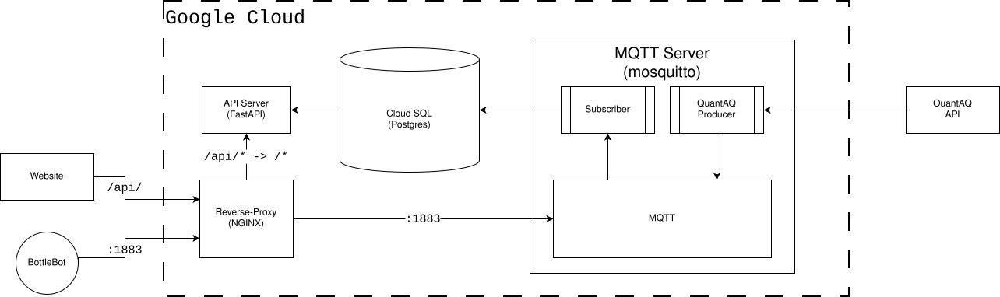

# "Change is in the Air" Project - Infrastructure


## Overview
The original description of the project was to develop a data pipeline that is capable of ingesting raw sensor data from the organization's growing fleet of [BottleBots](https://sensorbot.org) that are scattered around the Portland and Gresham areas. This raw sensor data would then be used to calculate Air-Quality Index (AQI) values that would be accessible through a simple web page interface.

While not explicitly stated in the original project summary, there were several requirements we could glean right away:
* BottleBots transmit their data over the MQTT protocol, so we needed a compatible Broker
* We needed a web API for the frontend application to talk to
* We needed a relational database
* (Most importantly) We needed a place to host all of this

Through the development of this project, the infrastructure became:
* 3x virtual machines:
  * Reverse-Proxy
  * API Host
  * MQTT Host
* 1x PostgreSQL Database

The team settled on using the _Google Cloud Platform_ for hosting and capturing the requirements _in code_ in the form of Terraform configuration files and Ansible script playbooks. This extra effort means that in only a few steps, the entire backend solution of the project can be brought back online.

1. [Prerequisites](#prerequisites)
1. [Google Cloud Platform](#google-cloud-platform) setup
1. Using [Terraform](#terraform) to provision resources
1. Running [Ansible](#ansible) playbooks
1. [Application Deployment](#application-deployment)

> **Note:** This document presumes that the reader is familiar with these technologies and some experience with proper secure DevOps practices. Explaining the further uses of `tofu` and `ansible` is something that can be further researched by the reader.

## Prerequisites
Your system will need to have the following programs installed:
* `gcloud` - Google Cloud CLI management application ([installation guide](https://docs.cloud.google.com/sdk/docs/install-sdk))
* `tofu` - An open-source Terraform client ([install options](https://opentofu.org/docs/intro/install/))
* `ansible` - An automation tool built in `python` and installed as a system-wide module using `pip`, Python's package manager ([installation guide](https://docs.ansible.com/projects/ansible/latest/installation_guide/intro_installation.html#pipx-install))
* `ssh` - An essential tool for securely accessing machines remotely

## Google Cloud Platform
```bash
# Log into your Google account that has access to the Cloud instance
$ gcloud auth login
# Create your project 
$ gcloud projects create <PROJECT_ID>
# Select this project as your current one (optional, but later code examples will assume this has been done)
$ gcloud config set project <PROJECT_ID>
```
It's important to keep track of your chosen `PROJECT_ID` for setting up [Terraform](#terraform) next. It can also be found by running `gcloud projects list` as an authorized user.

**Services:**  
Your account will require several services to be enabled in order to provision some of our resources, ie. `compute.googleapis.com` for managing virtual machines and `sqladmin.googleapis.com` for managing Cloud SQL instances.
```bash
$ gcloud services enable \
    compute.googleapis.com \
    sqladmin.googleapis.com \
    servicenetworking.googleapis.com \
    cloudresourcemanager.googleapis.com \
    iap.googleapis.com \
    iam.googleapis.com
```
> `iam.googleapis.com` is enabled by default on all GCP projects and does not need to be explicitly enabled. It is listed here for completeness as several IAM-related features depend on it and, perhaps more importantly, it was being requested as team members were being onboarded to the project.

## Terraform
Start off by doing the following:
```bash
# Change into the `terraform` directory of this repository
repo $ cd terraform
# Copy the example configuration file and dropping the `example` extension
repo/terraform $ cp terraform.tfvars.example terraform.tfvars
```
At the very top of the file, replace `your-gcp-project-id` with the `<PROJECT_ID>` defined in the previous section. Then set a value for `db_password` (if you don't, you will be prompted for one during the following step).

Finally, you can run:
```bash
repo/terraform $ tofu init
repo/terraform $ tofu apply
```
This will kick off the provisioning process.

**Team Management:**  
If you are looking for a quick-and-dirty way to give others the ability to work on the project, but not have them be considered admins, consider adding values to the `iap_tunnel_users` list. There are a few supported forms but the one we used was `user:<email_address>`. This did not always work 100% and, simply put, there may be oversights elsewhere (like the `tunnel.sh` script) that made more permissions necessary than there needed to be.

**Sharing Deployment:**  
It's worth noting that, if you're expecting to have multiple people with the ability to use `tofu` to manipulate the environment, you'll need to have a secrets sharing process so everyone that needs this ability can share the same `terraform.tfstate` and `.terraform.lock.hcl` files that get generated during the initial deployment.

## Ansible
Use `tofu output iap_tunnel_command_hint` to get the command (including the proper arguments) that you need to execute. It set's up 3 SSH tunnels (one to each VM) and establishes port-forwarding for the hosted services, as well as forwarding access to the database. Be sure to set up the tunnels before attempting to run the Ansible playbook.

```bash
repo $ cd ansible
repo/ansible $ ansible-playbook -i inventory site.yml
```
Once the playbook has completed each VM will have all the required system-level packages installed and any services properly configured and started.

## Application Deployment
This is a manual process where you must SSH into each VM that is the "target" of a deployment and manually pull down the latest changes and manipulate any files or system-services. Each VM has already had the repositories cloned; the repository URL and folder path are defined in `ansible/host_vars/<name>/main.yml`, if you'd like them changed.

There are two requirements for a successful deployment: creation of a `.env` file and creation of a `systemd` service. The `.env` file can be initialized from a copy of the `.env.example` file with updated values that are relevant to the environment. A `systemd` service file is created to ensure that the lifecycle's of our applications is controlled such as starting-on-boot and auto-restarting after crashing. You can see examples of some in the `ansible/roles/+/templates` directories of either the `fastapi` or `mosquitto` roles.
